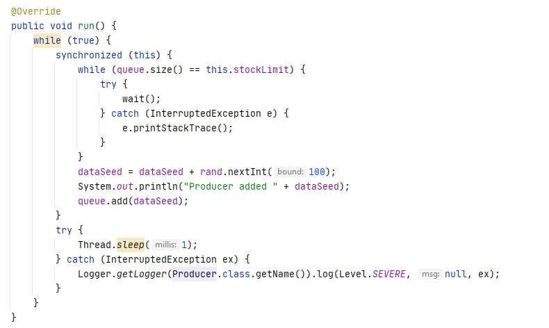

# Arsw-Lab2

## Estudiantes

  - Juan Camilo Angel Hernandez
  - Nicolas Aguilera Contreras
  
## Part I - Before finishing class

Thread control with wait/notify. Producer/consumer

1. Check the operation of the program and run it. While this occurs, run jVisualVM and check the CPU consumption of the corresponding process. Why is this consumption? Which is the responsible class?

Este consumo es debido a que las clases de Producer y Consumer están constantemente produciendo y consumiendo productos dentro de un ciclo infinito (while true).

La mayor responsabilidad del consumo de CPU es de parte del Consumidor debido a que siempre está consumiendo sin importar si hay o no productos. Por otra parte , la clase Producer tiene una pausa por cada cierto productos producidos que puede aliviar el consumo de CPU.

2. Make the necessary adjustments so that the solution uses the CPU more efficiently, taking into account that - for now - production is slow and consumption is fast. Verify with JVisualVM that the CPU consumption is reduced. 

Metodo run() en Consumer

Consumo de CPU reducido

3. Make the producer now produce very fast, and the consumer consumes slow. Taking into account that the producer knows a Stock limit (how many elements he should have, at most in the queue), make that limit be respected. Review the API of the collection used as a queue to see how to ensure that this limit is not exceeded. Verify that, by setting a small limit for the 'stock', there is no high CPU consumption or errors.

Metodo run() en Producer

Metodo run() en Consumer

Consumo de CPU se mantiene a pesar de que el productor produce rapido y el consumidor lento.

