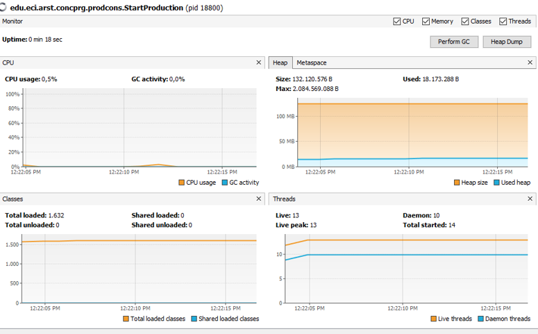

# Arsw-Lab2

## Estudiantes

  - Juan Camilo Angel Hernandez
  - Nicolas Aguilera Contreras
  
## Getting Started

The following instructions will allow you to have a copy of the project and run it on your machine.

### Prerequisites

* [Maven](https://maven.apache.org/) - Dependency Management
* [Java 8](https://www.oracle.com/co/java/technologies/javase/javase-jdk8-downloads.html) -  Development Environment 
* [Git](https://git-scm.com/) - Version Control System
  
## Part I - Before finishing class

### Installing

1. Clone the repository

```
git clone https://github.com/juancamilo399/SparkWebMean.git
```

2. Compile the projet

```
go to \IMMORTALS

mvn package
```

3. Executing the program

```
mvn exec:java -D "exec.mainClass"="edu.eci.arst.concprg.prodcons.StartProduction"
```

Thread control with wait/notify. Producer/consumer

1. Check the operation of the program and run it. While this occurs, run jVisualVM and check the CPU consumption of the corresponding process. Why is this consumption? Which is the responsible class?

Este consumo es debido a que las clases de Producer y Consumer están constantemente produciendo y consumiendo productos dentro de un ciclo infinito (while true).

La mayor responsabilidad del consumo de CPU es de parte del Consumidor debido a que siempre está consumiendo sin importar si hay o no productos. Por otra parte , la clase Producer tiene una pausa por cada cierto productos producidos que puede aliviar el consumo de CPU.


2. Make the necessary adjustments so that the solution uses the CPU more efficiently, taking into account that - for now - production is slow and consumption is fast. Verify with JVisualVM that the CPU consumption is reduced. 

Metodo run() en Consumer


Consumo de CPU reducido



3. Make the producer now produce very fast, and the consumer consumes slow. Taking into account that the producer knows a Stock limit (how many elements he should have, at most in the queue), make that limit be respected. Review the API of the collection used as a queue to see how to ensure that this limit is not exceeded. Verify that, by setting a small limit for the 'stock', there is no high CPU consumption or errors.

Metodo run() en Producer


Metodo run() en Consumer


Consumo de CPU se mantiene a pesar de que el productor produce rapido y el consumidor lento.


## Part 2
1. Review the “highlander-simulator” program, provided in the edu.eci.arsw.highlandersim package. This is a game in which:
  - You have N immortal players. 
  - Each player knows the remaining N-1 player.
  - Each player permanently attacks some other immortal. The one who first attacks subtracts M life points from his opponent, and increases his own life points by the same amount. 
  - The game could never have a single winner. Most likely, in the end there are only two left, fighting indefinitely by removing and adding life points. 

2. Review the code and identify how the functionality indicated above was implemented. Given the intention of the game, an invariant should be that the sum of the life points of all players is always the same (of course, in an instant of time in which a time increase / reduction operation is not in process ). For this case, for N players, what should this value be?

- El total de la salud será igual al numero de jugadores (N) multiplicado su salud inicial.

3. Run the application and verify how the ‘pause and check’ option works. Is the invariant fulfilled?

- El invariante no se cumple ya que la vida debería ser igual a 300 debido a que existen 3 inmortales con una vida de 100 inicialmente.


4. A first hypothesis that the race condition for this function (pause and check) is presented is that the program consults the list whose values it will print, while other threads modify their values. To correct this, do whatever is necessary so that, before printing the current results, all other threads are paused. Additionally, implement the ‘resume’ option.

 - Implementamos el mecanismo de pausa y utilizamos un AtomicInteger para representar la salud  y garantizar el invariante.


5. Check the operation again (click the button many times). Is the invariant fulfilled or not ?.

 - El invariante ahora si se cumple.


6. Identify possible critical regions in regards to the fight of the immortals. Implement a blocking strategy that avoids race conditions. Remember that if you need to use two or more ‘locks’ simultaneously, you can use nested synchronized blocks

 - La región critica se encuentra en el método fight de la clase Inmortal y se solucionó mediante la sincronización del método.


7. After implementing your strategy, start running your program, and pay attention to whether it comes to a halt. If so, use the jps and jstack programs to identify why the program stopped.


8. Once the problem is corrected, rectify that the program continues to function consistently when 100, 1000 or 10000 immortals are executed. If in these large cases the invariant begins to be breached again, you must analyze what was done in step 4.

9. An annoying element for the simulation is that at a certain point in it there are few living 'immortals' making failed fights with 'immortals' already dead. It is necessary to suppress the immortal dead of the simulation as they die. 

  - Analyzing the simulation operation scheme, could this create a race condition? Implement the functionality, run the simulation and see what problem arises when there are many 'immortals' in it. Write your conclusions about it in the file ANSWERS.txt.

  - Correct the previous problem WITHOUT using synchronization, since making access to the shared list of immortals sequential would make simulation extremely slow. 

10. To finish, implement the STOP option.
